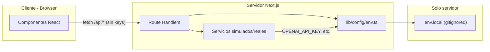
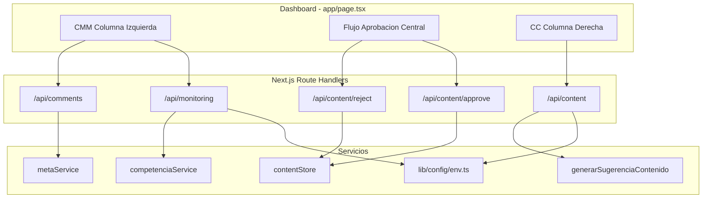
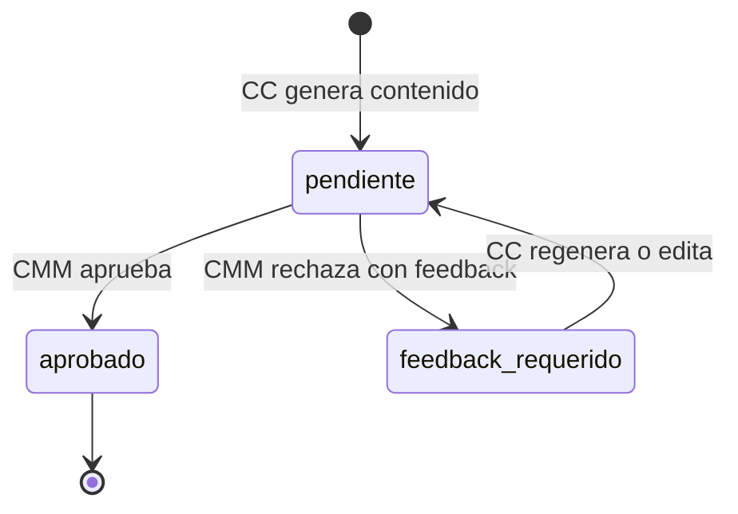

# Plan de desarrollo: Plataforma Demo ASAP (CMM + CC)

## Contexto

Repositorio en fase inicial ([README.md](README.md)). Se construye desde cero un **dashboard unificado** para dos roles:

- **CMM**: monitoreo, rendimiento, comentarios, aprobación de contenido.
- **CC**: sugerencias y generación de contenido.

Integraciones externas (n8n, OpenAI, Meta Graph API) permanecen **simuladas en la demo**, pero el plan establece **patrones de seguridad reales** para que el swap a producción no requiera refactor de arquitectura.

---

## Stack y convenciones

| Capa | Tecnología |
|------|------------|
| Framework | Next.js 14, App Router |
| UI | [shadcn/ui](https://ui.shadcn.com/) (Radix + Tailwind, componentes copiados al repo) |
| Lenguaje | TypeScript (strict) |
| Estilos | TailwindCSS + CSS variables de shadcn (`globals.css`) |
| Validación env | Zod en `lib/config/env.ts` |
| Estado UI | React hooks + fetch a Route Handlers |
| Persistencia demo | Arrays/objetos en memoria en módulos de servidor |

**Convenciones**: servicios en español (`competenciaService`, `generarSugerenciaContenido`), tipos PascalCase, rutas API en inglés.

---

## shadcn/ui: setup y componentes base

### Bootstrap (Fase 1, inmediatamente después de `create-next-app`)

```bash
npx create-next-app@14 . --typescript --tailwind --eslint --app --src-dir=false --import-alias="@/*"
npx shadcn@latest init
```

Opciones recomendadas en `init`: estilo **New York**, base color **neutral**, CSS variables **on**, iconos **lucide-react** (default).

Instalar componentes al inicio de Fase 1:

```bash
npx shadcn@latest add button card badge input textarea dialog popover scroll-area skeleton alert separator tooltip
```

### Estructura UI resultante

```
components/
  ui/                    # Componentes shadcn (generados por CLI, no editar salvo theming)
  dashboard/
    DashboardLayout.tsx  # Grid 3 columnas con Card + Separator
  cmm/ ...
  approval/ ...
  cc/ ...
lib/
  utils.ts               # cn() — generado por shadcn init
components.json          # Config CLI shadcn
```

### Mapeo componentes shadcn → dashboard

| Sección | Componentes shadcn |
|---------|-------------------|
| Layout general | `Card`, `CardHeader`, `CardContent`, `Separator`, `ScrollArea` |
| ContentCard / feed | `Card`, `Badge` (estados), `Button`, `Textarea` |
| Generar sugerencia (CC) | `Input`, `Button`, `Skeleton` (loading) |
| Comentarios (hover/reply) | `Popover` o `Dialog`, `Button`, `Textarea`, `Tooltip` |
| Errores API | `Alert` (variant destructive) |
| Monitoreo | `Badge` (tendencia), `Skeleton` (polling) |

**Regla**: no usar clases Tailwind ad-hoc para botones, inputs o modales; extender variantes shadcn existentes. Theming ASAP vía CSS variables en `app/globals.css` (primary, muted, destructive).

---

## Gestión segura de API Keys

Principio: **ningún secreto en el cliente**. Las keys solo existen en variables de entorno **sin** prefijo `NEXT_PUBLIC_` y solo se leen en Route Handlers y módulos `lib/` marcados como server-only.



### Variables de entorno

Crear [`.env.example`](.env.example) (commiteable, sin valores reales):

```bash
# Webhook n8n — validar POST /api/monitoring
N8N_WEBHOOK_SECRET=

# OpenAI — solo servidor, Fase 3+
OPENAI_API_KEY=

# Meta Graph API — solo servidor, Fase 5+
META_ACCESS_TOKEN=
META_PAGE_ID=

# Modo demo: true = simular aunque existan keys
USE_MOCK_APIS=true
```

Archivos reales en `.env.local` (nunca commitear). Verificar [`.gitignore`](.gitignore) incluye `.env*` excepto `.env.example`.

### Módulo central: `lib/config/env.ts`

- Validar con **Zod** al importar (fail-fast en boot del servidor).
- Exportar objeto tipado `env` con getters; valores opcionales en demo (`USE_MOCK_APIS=true`).
- Función `assertServerOnly()`: documenta que el módulo no debe importarse desde `"use client"`.

```typescript
// Esquema simplificado
const envSchema = z.object({
  N8N_WEBHOOK_SECRET: z.string().min(1).optional(),
  OPENAI_API_KEY: z.string().min(1).optional(),
  META_ACCESS_TOKEN: z.string().min(1).optional(),
  META_PAGE_ID: z.string().optional(),
  USE_MOCK_APIS: z.coerce.boolean().default(true),
});
```

### Reglas por integración

| Integración | Dónde usa la key | Validación |
|-------------|------------------|------------|
| n8n webhook | `POST /api/monitoring` | Header `Authorization: Bearer <N8N_WEBHOOK_SECRET>` o `X-Webhook-Secret`; rechazar con **401** si falta o no coincide |
| OpenAI | `lib/services/generarSugerenciaContenido.ts` | Solo si `!env.USE_MOCK_APIS && env.OPENAI_API_KEY`; si no, plantillas mock |
| Meta | `lib/services/metaService.ts` | Solo si `!env.USE_MOCK_APIS && env.META_ACCESS_TOKEN`; si no, simular reply |
| Cliente React | Nunca | Solo `fetch('/api/...')` — sin keys en props, state, ni logs |

### Patrón en Route Handlers

```typescript
// app/api/monitoring/route.ts (POST)
import { env } from '@/lib/config/env';

function validateWebhookSecret(request: Request): boolean {
  if (!env.N8N_WEBHOOK_SECRET) return env.USE_MOCK_APIS; // demo sin secret
  const auth = request.headers.get('authorization');
  return auth === `Bearer ${env.N8N_WEBHOOK_SECRET}`;
}
```

### Anti-patrones prohibidos

- `NEXT_PUBLIC_OPENAI_API_KEY` o cualquier `NEXT_PUBLIC_*` con secretos.
- Pasar keys como query params desde el front-end.
- Loguear valores de keys (solo log `"OpenAI: configured"` / `"OpenAI: mock mode"`).
- Commitear `.env.local` o keys en mocks/código fuente.

### Documentación

Actualizar [README.md](README.md) con: copiar `.env.example` → `.env.local`, descripción de cada variable, y curl de ejemplo para webhook autenticado.

---

## Arquitectura objetivo



---

## Fase 1: Estructura, shadcn y Dashboard

**Objetivo:** Proyecto Next.js + shadcn/ui + dashboard 3 columnas con mocks.

### Tareas

1. Bootstrap Next.js 14 + `shadcn init` + componentes UI listados arriba.
2. Configurar `app/layout.tsx` con fuentes shadcn y tema neutral.
3. Crear `.env.example`, `.gitignore` para env, y `lib/config/env.ts` (Zod, `USE_MOCK_APIS=true`).
4. Implementar `DashboardLayout` con grid `grid-cols-1 lg:grid-cols-12` y secciones en `Card`.
5. Mocks en `lib/mocks/`; componentes CMM, Approval, CC usando shadcn (no HTML crudo).

### Criterios de done

- Dashboard en `localhost:3000` con estilo shadcn consistente.
- Responsive (mobile: columnas apiladas).
- `.env.example` documentado; app arranca sin `.env.local` en modo mock.
- Sin secretos en bundle cliente (verificar: no `NEXT_PUBLIC_` secrets, no keys en componentes).

---

## Fase 2: Backend CMM — Monitoreo (n8n simulado + webhook seguro)

**Objetivo:** Webhook autenticado + servicio de competencia + columna CMM con polling.

### Tipos (`types/competencia.ts`)

Sin cambios respecto al plan original (`Competencia`, `DatosRendimiento`, `TendenciaItem`).

### Servicio (`lib/services/competenciaService.ts`)

Store en memoria + `procesarWebhook`, `getTendencias`, `getRendimiento`.

### API (`app/api/monitoring/route.ts`)

| Método | Seguridad | Uso |
|--------|-----------|-----|
| `POST` | Validar `N8N_WEBHOOK_SECRET` (401 si inválido; omitir en demo si `USE_MOCK_APIS` y sin secret) | Payload n8n simulado |
| `GET` | Público en demo (sin auth) | Polling front-end |

### Front-end

- `MonitoreoTendencias`, `Rendimiento`: polling 5–10s; botón **Simular webhook** (POST desde UI, sin exponer secret — el botón llama a un Route Handler interno o usa secret solo server-side vía Server Action opcional).
- Preferencia: botón demo que llama `POST /api/monitoring/demo` protegido solo en dev, o Server Action que inyecta el secret server-side.

### Criterios de done

- POST autenticado actualiza UI; POST sin secret falla con 401 cuando `N8N_WEBHOOK_SECRET` está configurado.
- UI usa `Skeleton` durante carga y `Alert` en error.

---

## Fase 3: Backend CC — Generación de contenido (OpenAI simulado)

**Objetivo:** Proxy server-side con modo mock/real controlado por env.

### Servicio (`lib/services/generarSugerenciaContenido.ts`)

```typescript
if (!env.USE_MOCK_APIS && env.OPENAI_API_KEY) {
  // Llamada real OpenAI (server-only)
} else {
  // Plantillas mock + latencia simulada
}
```

Key **nunca** sale de este módulo.

### API (`app/api/content/route.ts`)

- `POST { tema }` → genera `SugerenciaContenido`, persiste en `contentStore`.
- `GET` → lista contenidos.

### Front-end (shadcn)

- `Input` tema + `Button` "Generar Sugerencia".
- `Skeleton` en tarjeta mientras genera; `Alert` si falla.

### Criterios de done

- Con `USE_MOCK_APIS=true`, funciona sin `OPENAI_API_KEY`.
- Con `USE_MOCK_APIS=false` + key válida, ruta real (opcional para validación pre-prod).

---

## Fase 4: Bucle de aprobación CMM ↔ CC

**Objetivo:** Flujo aprobar/rechazar con feedback obligatorio.

### Store (`lib/store/contentStore.ts`)

Singleton en memoria (`Map<string, SugerenciaContenido>`).

### API Routes

- `POST /api/content/approve` — `{ id }`
- `POST /api/content/reject` — `{ id, feedback }` (400 si feedback vacío)

### Front-end (shadcn)

- `ContentCard`: `Badge` por estado, `Button` Aprobar/Rechazar, `Textarea` feedback (visible al rechazar).
- `Alert` para errores de validación.

### Diagrama de estados



### Criterios de done

- Rechazo sin feedback → 400 + `Alert` en UI.
- Estados visibles con `Badge` shadcn.

---

## Fase 5: Interacción social — Meta API simulada

**Objetivo:** Comentarios con respuesta IA y reply simulado.

### Servicios

- `metaService.ts`: usa `META_ACCESS_TOKEN` solo si `!USE_MOCK_APIS`.
- `respuestaIAService.ts`: mock por sentiment; opcional OpenAI server-side con misma regla env.

### API Routes

- `GET /api/comments`
- `GET /api/comments/[id]/suggest`
- `POST /api/comments/[id]/reply`

### Front-end (`ComentariosRecientes`)

- Lista en `ScrollArea`; sentiment con `Badge`.
- `Popover`/`Dialog` para respuesta sugerida y envío; `Tooltip` en acciones.

### Criterios de done

- Hover/tap revela acciones shadcn.
- Reply persiste en memoria; sin token Meta en cliente.

---

## Orden de implementación

1. **Fase 1** — Next + shadcn + env scaffold + dashboard mock
2. **Fase 2** — Monitoring + webhook auth
3. **Fase 3** — Content generation + OpenAI pattern
4. **Fase 4** — Approval loop
5. **Fase 5** — Comments + Meta pattern

Validar cada fase antes de continuar.

---

## Archivos clave (resumen)

| Fase | Archivos |
|------|----------|
| 1 | `components.json`, `components/ui/*`, `lib/config/env.ts`, `.env.example`, `app/page.tsx`, `components/dashboard/*` |
| 2 | `app/api/monitoring/route.ts`, `lib/services/competenciaService.ts` |
| 3 | `app/api/content/route.ts`, `lib/services/generarSugerenciaContenido.ts` |
| 4 | `app/api/content/approve|reject/route.ts`, `lib/store/contentStore.ts` |
| 5 | `app/api/comments/**`, `lib/services/metaService.ts` |

---

## Riesgos y decisiones

- **Estado en memoria**: se pierde al reiniciar — aceptable para demo; documentar en README.
- **Polling vs SSE**: polling simple en Fase 2.
- **Sin auth de usuario**: demo single-user; las API keys protegen webhooks e integraciones externas, no login UI.
- **Simulación por defecto**: `USE_MOCK_APIS=true` evita keys obligatorias en desarrollo; producción cambia env sin tocar UI.
- **shadcn copy-paste**: componentes viven en el repo; actualizar vía CLI (`npx shadcn@latest add`) cuando haga falta.

---

## Validación final

1. Dashboard shadcn con 3 columnas
2. Webhook POST rechaza requests sin secret (cuando configurado)
3. CC genera sugerencia → feed central
4. CMM aprueba/rechaza con feedback
5. Comentarios con popover/dialog y reply simulado
6. **Auditoría seguridad**: `grep -r NEXT_PUBLIC_.*KEY` vacío; keys solo en `lib/config/env.ts` y servicios server
